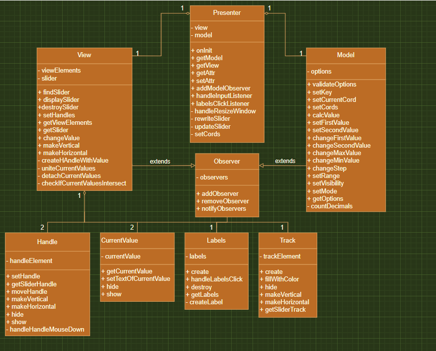

# MetaLamp 4 задание slider для jQuery

---

Необходимо написать плагин для <i>jQuery</i>, в котором реализована функцианальность слайдера или "бегунка".
Плагин писался для <i>jQuery 3.6.0</i>
[demo-page](https://samirox66.github.io/ngSlider/)

## Архитектура

---

Плагин спроектирован в соотвествии с MVP архитектурой с Passive View. Такой подход позволяет отделить бизнес-логику от отображения. Отвязка слоёв приложения осуществляется благодаря использованию паттерна Observer, который расширяет основные модули и позволяет им взаимодействовать, ничего не зная друг о друге.

## Развертывание

##### Клонирование репозитория

    git clone https://github.com/Samirox66/hotel.git

##### Установка зависимостей

    npm install

##### Development сборка

    npm run dev

##### Production сборка

    npm run build

##### Разработка

    npm start

### Model

<i>Model</i> является модулем отвечающим за хранение всего состояния приложения и расчеты, которые относятся к бизнес-логике. Предоставляет методы для чтения и записи всех параметров либо каждого по отдельности.

### View

<i>View</i> отвечает за создание отображения, его обновление и взаимодействие с пользователем и наследуется от класса <i>Observer</i>. Отображение разбито на более мелкие элементы <i>viewElements</i>, которые передают события c помощью функцию <i>notifyObservers</i>, переданной из <i>View</i>. Данный метод позволяет viewElements оставаться низкоуровневыми элементами и ничего не знать о модулях высокого уровня, но при этом всегда иметь доступ к актуальному состоянию для внутренних расчетов.

### Presenter

<i>Presenter</i> - единственный модуль, который имеет зависимости от других слоев приложения.

- Cоздает модель и отображение
- Подписывается на изменения модели и отображения
- Реагирует на сообщения об обновлении модели и обновляет отображение
- Реагирует на сообщения от отображения о действиях пользователей и обновляет модель
- Формирует кастомное событие, для того, чтобы была возможность получать актуальные данные либо осуществлять стороннюю логику при перемещении слайдера.

Таким образом передача данных снизу вверх осуществляется следующим образом <i>viewElements</i> -> <i>View</i> -> <i>Presenter</i> -> <i>Model</i>.

## Диаграмма

---

